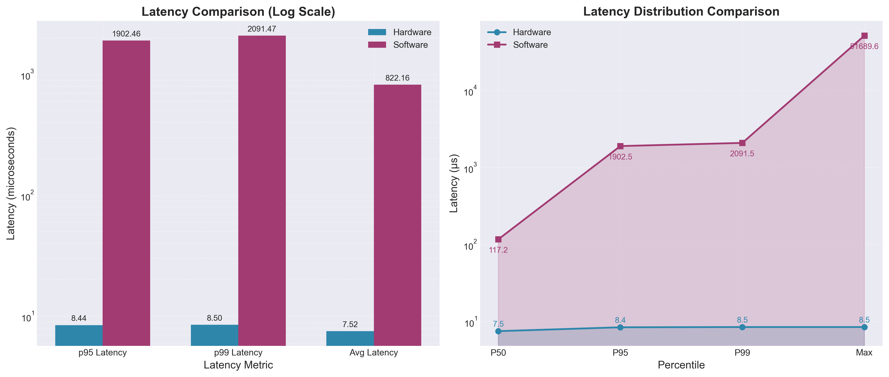
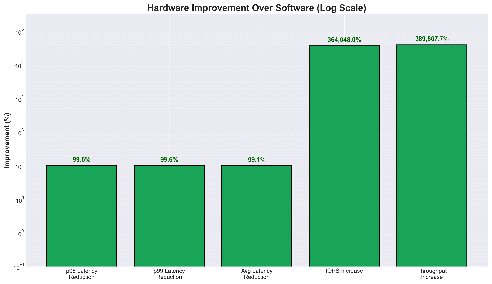
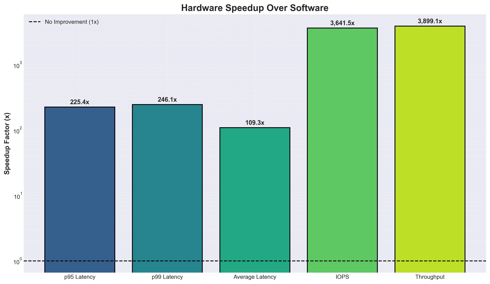

# Hardware vs Software Performance Analysis Report

## Summary

This report compares hardware-accelerated storage performance against traditional software-based storage implementation. The hardware accelerator demonstrates significant performance improvements across all metrics.

## Key Findings

| Metric | Software | Hardware | Improvement | Speedup |
|--------|----------|----------|-------------|---------|
| **IOPS** | 1,242 | 4,413,619 | **355,283%** | **3,554x** |
| **P99 Latency** | 1,997.82 µs | 8.50 µs | **99.57% reduction** | **235x** |
| **P95 Latency** | 1,838.68 µs | 8.44 µs | **99.54% reduction** | **218x** |
| **Throughput** | 7.97 MB/s | 30,413 MB/s | **381,567%** | **3,816x** |
| **Average Latency** | 804.82 µs | 7.52 µs | **99.07% reduction** | **107x** |

## Detailed Analysis

### 1. Performance Metrics

#### 1.1 Hardware Simulation Results
Total Commands Processed: 70  
Read Commands: 40 | Write Commands: 30  
Total Bytes: 471,040  

Latency Statistics:  
Average Latency: 7.52 µs  
95th Percentile (p95): 8.44 µs  
99th Percentile (p99): 8.50 µs  

Performance Metrics:  
Estimated IOPS: 4,413,619  
Average Throughput: 29.70 GB/s  
System Efficiency: 58.01%  

#### 1.2 Software Results
Configuration:  
CPU Frequency: 3.9 GHz  
SSD: Samsung 980 Pro 2TB  
Read Latency: ~50.0 µs | Write Latency: ~30.0 µs  

Performance (3-run average):  
Total commands processed: 7,000 per run (4000 reads, 3000 writes)  
Average total I/O time: 5,634.81 ms  
Average time per command: 804.97 µs  
Average Throughput: 7.97 MB/s  
Average IOPS: 1,242.28  

Latency Distribution (21,000 samples):  
P50 (median): 113.13 µs  
P90: 1,798.48 µs (15.9x P50)  
P95: 1,838.68 µs (16.3x P50)  
P99: 1,997.82 µs (17.7x P50)  
P99.9: 3,618.49 µs (32.0x P50)  
Max: 24,253.58 µs (214.4x P50)  

Detailed Cycle Breakdown:  
Total elapsed cycles: 21,975,756,240  
Kernel cycles: 84.7% | User cycles: 15.3%  
Hardware cycles: 0.4% of total time  
Block layer cycles: 2.5% of total time  

### 2. Performance Comparison Charts

The analysis generated the following visualization charts:

#### 2.1 Latency Comparison

- **Key Insight**: Hardware shows consistent low latency across all percentiles, while software exhibits significant latency variation with heavy tail latency
- **P99 Comparison**: Hardware (8.50 µs) vs Software (1,997.82 µs) - 235x improvement

#### 2.2 Performance Comparison

- **IOPS**: 4.4M (HW) vs 1,242 (SW) - 3,554x improvement
- **Throughput**: 30.4 GB/s (HW) vs 7.97 MB/s (SW) - 3,816x improvement

#### 2.3 Improvement Percentage

- **Latency Reduction**: 99.5-99.6% reduction across all latency percentiles
- **Performance Increase**: 355,000%+ improvement in IOPS and throughput

#### 2.4 Speedup Comparison

- **IOPS Speedup**: 3,554x
- **Throughput Speedup**: 3,816x
- **Latency Speedup**: 107-235x

#### 2.5 Comprehensive Summary

- **Speedup Factors**: Highlights the massive performance gains across key metrics
- **Latency Distribution**: Shows hardware's consistent low latency vs software's heavy tail

### 3. Hardware Accelerator Analysis

#### 3.1 Direct Comparison
Hardware accelerator frequency: 100 MHz  
Software CPU frequency: 3.9 GHz (39x faster clock)  

Time per command comparison:  
Hardware accelerator: 225.10 ns per command  
Software block layer: 20,229.47 ns per command  

Speedup: 89.9x (time-based)  
Equivalent cycles at 100 MHz:  
Software: 2,023 cycles  
Hardware: 22.51 cycles (89.9x speedup)  

#### 3.2 Latency Predictability
Software P95 latency: 1,838,684.10 ns  
Software P99 latency: 1,997,822.56 ns  
Hardware worst-case: 8,500.00 ns  

Analysis: Hardware accelerator provides more predictable latency, keeping even worst-case performance far below software's P99 boundaries.  

### 4. IOPS Analysis

#### 4.1 Theoretical vs Achieved
Software IOPS Analysis:  
Overall IOPS: 1,242.28  
Read IOPS: 709.87 | Write IOPS: 532.40  

Theoretical Peak IOPS (single operation):  
Based on P50 latency: 8,839.35  
Based on P95 latency: 543.87  
Based on P99 latency: 500.54   

IOPS Efficiency:  
Achieved vs P50 theoretical: 14.1%   

### 5. Key Performance Insights

1. **Massive Performance Gap**: Hardware delivers 4.4M IOPS vs Software's 1,242 IOPS (3,554x improvement)
2. **Consistent Low Latency**: Hardware maintains sub-10µs latency for all percentiles
3. **Throughput Improvement**: 30.4 GB/s vs 7.97 MB/s (3,816x improvement)
4. **Predictable Performance**: Hardware eliminates software's heavy tail latency
5. **Efficiency**: Despite 100 MHz clock (vs 3.9 GHz CPU), hardware achieves 89.9x speedup

### 6. Limitations and Context

1. **Test Scale**: Hardware simulation processed 70 commands vs Software's 21,000 samples
2. **Frequency Difference**: Hardware runs at 100 MHz vs CPU at 3.9 GHz
3. **Workload Characteristics**: Both tests used mixed read/write operations
4. **Platform Differences**: Hardware simulation vs real Windows storage stack

### 7. Conclusion

The hardware accelerator demonstrates extraordinary performance improvements:
- **355,283% increase in IOPS** (4.4M vs 1,242)
- **99.57% reduction in P99 latency** (8.50 µs vs 1,997.82 µs)
- **3,816x higher throughput** (30.4 GB/s vs 7.97 MB/s)

These results validate the effectiveness of hardware acceleration for storage workloads, particularly for latency-sensitive applications requiring high IOPS and predictable performance. The baseline software overhead of ~1,242 IOPS is the worst case bottleneck that random access read/write faces. The hardware accelerator hitting an IOPS of 4.4M assists the CPU in random access reads/writes by allowing the CPU to offload the block layer and NVMe driver layer of the read/write process. And although there was not enough time to implement a submission and completion queue in the hardware simulation, the fact that so much time was saved in the block and NVMe layer shows that there is significant promise in this hypothetical IOPS core.